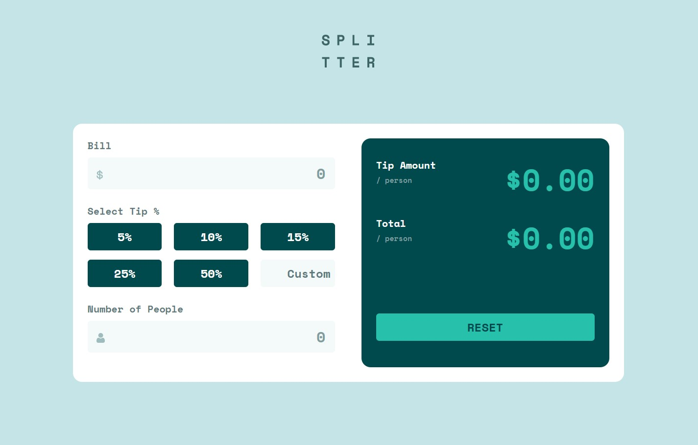

# Frontend Mentor - Tip calculator app solution

This is a solution to the [Tip calculator app challenge on Frontend Mentor](https://www.frontendmentor.io/challenges/tip-calculator-app-ugJNGbJUX). Frontend Mentor challenges help you improve your coding skills by building realistic projects.

## Table of contents

- [Overview](#overview)
  - [The challenge](#the-challenge)
  - [Screenshot](#screenshot)
  - [Links](#links)
- [My process](#my-process)
  - [Built with](#built-with)
  - [What I learned](#what-i-learned)
  - [Useful resources](#useful-resources)
- [Author](#author)

## Overview

### The challenge

Users should be able to:

- View the optimal layout for the app depending on their device's screen size
- See hover states for all interactive elements on the page
- Calculate the correct tip and total cost of the bill per person

### Screenshot

### Links

- Solution URL: [Solution](https://github.com/al-latte/tip-calulator-app-frontend-mentor)
- Live Site URL: [Live](https://al-latte.github.io/tip-calulator-app-frontend-mentor/)

### Built with

- Semantic HTML5 markup
- CSS custom properties
- Flexbox
- CSS Grid
- Mobile-first workflow
- Vanilla JavaScript

### What I learned

Problems are solved through trial and error.

### Useful resources

- [30 Days of JavaScript](https://github.com/Asabeneh/30-Days-Of-JavaScript) - This helped me to get started with JavaScript.

## Author

- GitHub Profile - [karlisha Roberts](https://github.com/al-latte)
- Frontend Mentor - [@al-latte](https://www.frontendmentor.io/profile/al-latte)
- Instagram - [@kally.dev](https://www.twitter.com/yourusername)
